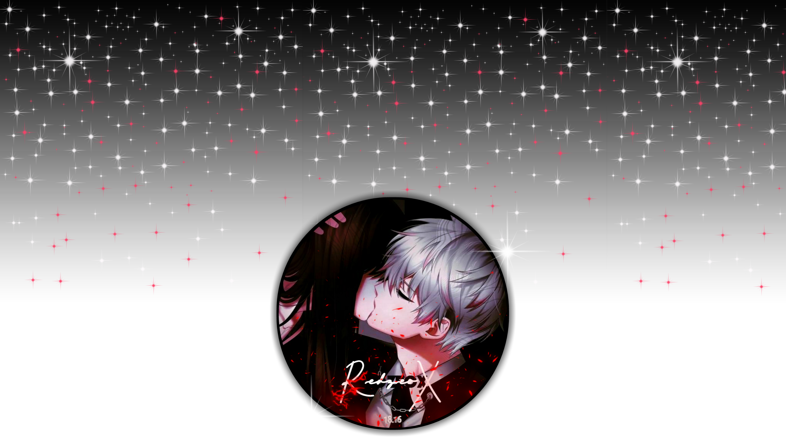

<h3 align="center"> ʜᴇʟʟᴏ ᴛʜᴇʀᴇ ɪ'ᴍ ʀᴇᴅᴢᴇᴏꭗ </h3>

## 

   
<a href="https://instagram.com/say.scotch" target="_blank"> 

  

 

 

## ✧ 〘 ʀɪᴀꜱ ɢʀᴇᴍᴏʀʏ-ᴍᴅ 〙
<a href="https://github.com/REDZEOX/Rias-gremory">
    

 ## ✧ 〘 ᴀᴛʟᴀꜱ-ᴍᴅ 〙
<a href="https://github.com/REDZEOX/Atlas-MD">
  
 

<!--
- 🔭 I’m currently working on ...
- 🌱 I’m currently learning ...
- 👯 I’m looking to collaborate on ...
- 🤔 I’m looking for help with ...
- 💬 Ask me about ...
- 📫 How to reach me: ...
- 😄 Pronouns: ...
- ⚡ Fun fact: ...
-->

